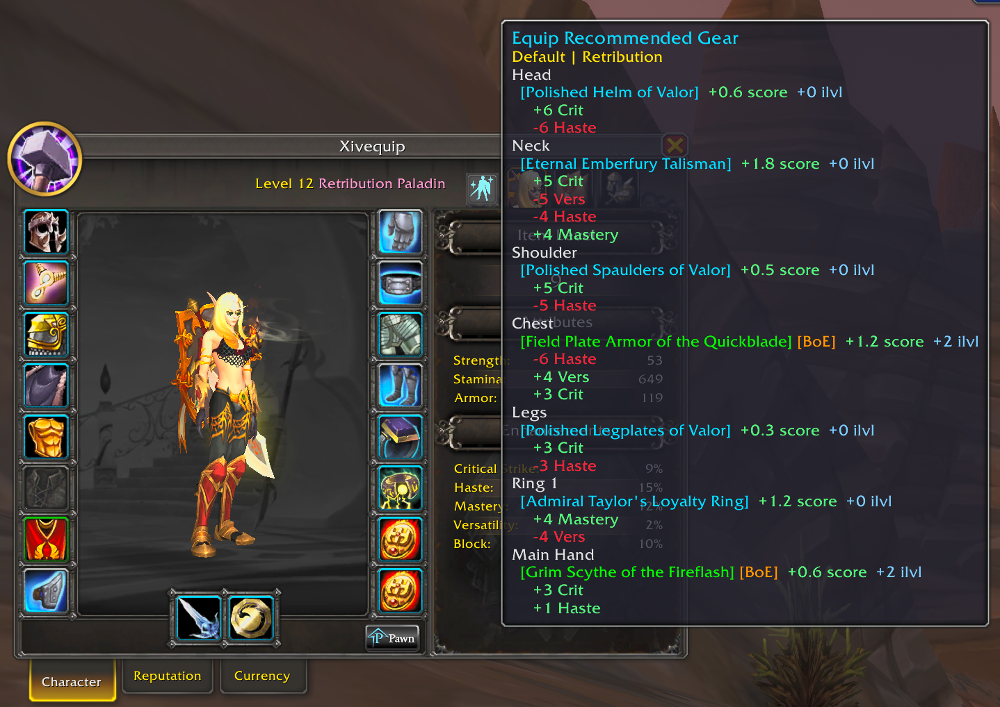
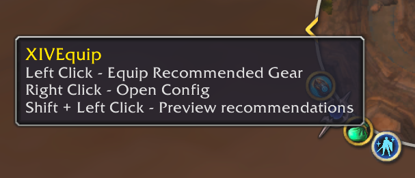
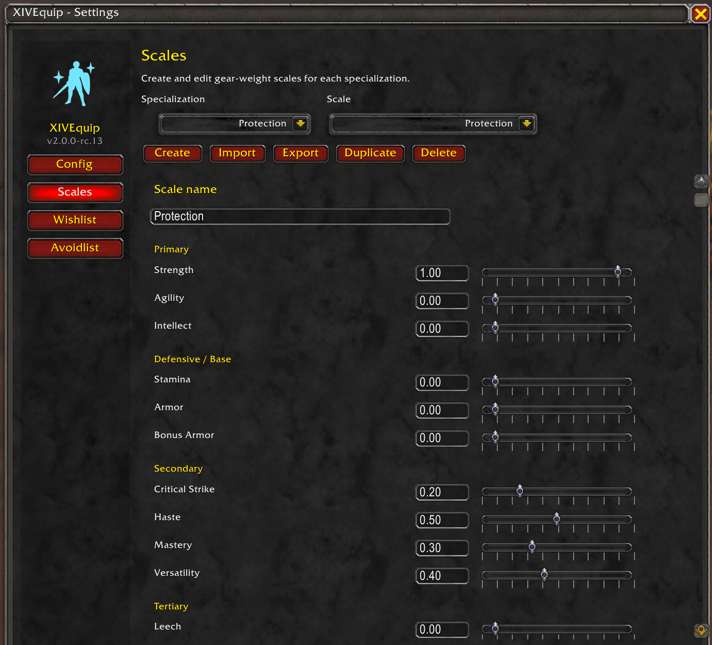
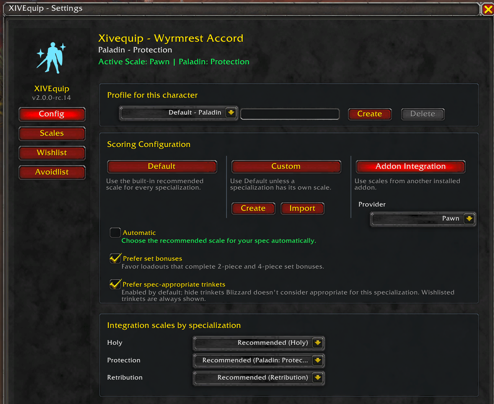
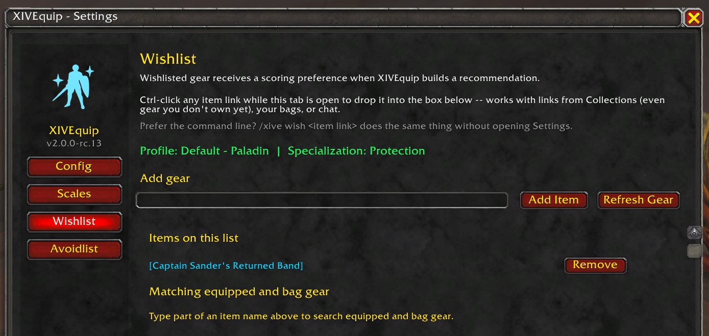
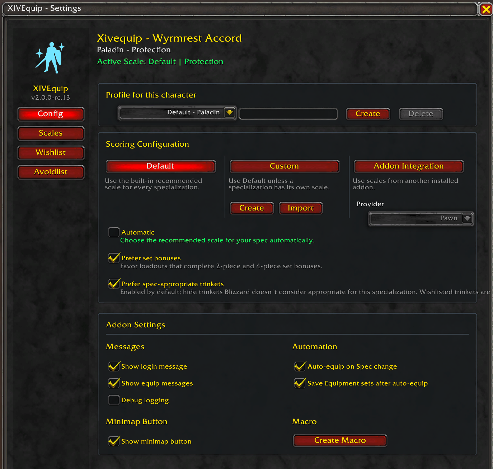
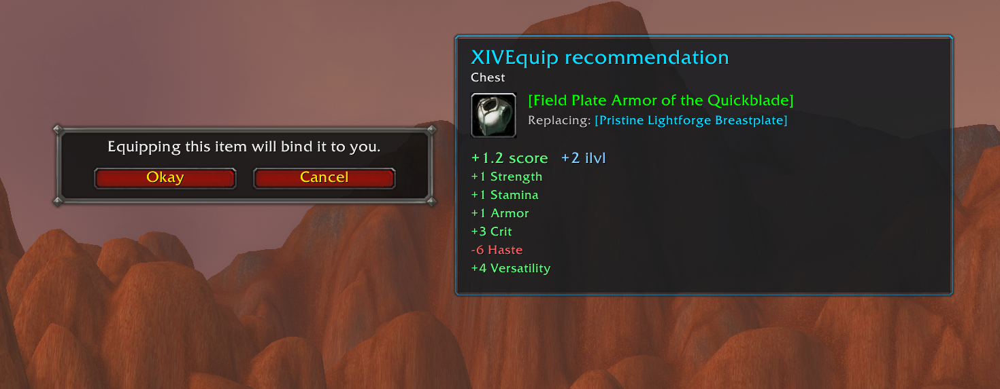

# XIVEquip — Equip Recommended Gear for World of Warcraft

> **CurseForge Summary field:**  
> FFXIV-style Equip Recommended Gear for WoW — smart, spec-aware gearing from the items already in your bags.

## Stop digging through your bags

XIVEquip brings Final Fantasy XIV's **Equip Recommended Gear** experience to World of Warcraft.

Leveling and drowning in quest rewards? Swapping to an off-spec you haven't played in six levels? Just want to know whether the gear in your bags is actually better than what you're wearing?

**XIVEquip scans the gear you already own, recommends a complete setup for your current specialization, and can equip it for you.**

No spreadsheets. No bag archaeology. **No Pawn required.**

## Preview it. Equip it. Done.

XIVEquip is designed to be useful immediately after installation.

1. **Preview your recommended gear** to see what XIVEquip wants to change.
2. Review the expected score, item-level difference, and stat changes.
3. **Equip Recommended Gear** and XIVEquip equips the upgrades it found.

Already wearing the best setup it can find? XIVEquip simply tells you there are **no upgrades**.

The minimap button keeps the common actions close at hand:

- **Left-click:** Equip Recommended Gear
- **Shift + Left-click:** Preview recommendations
- **Right-click:** Open settings

## Smarter than “highest item level wins”

WoW gear can be complicated. XIVEquip accounts for that.

It looks at your equipment as a **complete loadout**, so it can make sensible choices when several slots affect each other. That includes:

- Correct armor and weapons for your specialization
- Dual-wield, two-handed, shield, and off-hand setups
- Fury Warrior Titan's Grip and Frost Death Knight weapon choices
- Ring and trinket pairs
- Unique-Equipped restrictions
- 2-piece and 4-piece set bonuses
- Spec-appropriate trinkets
- Your own Wishlist and Avoidlist preferences

That also means XIVEquip can sometimes recommend a lower-item-level piece when its stats make it the better choice for the weights you're using.

## Works out of the box — customize it when you want to

XIVEquip includes **built-in stat weights for every specialization**, so you can install it and start using it without another addon.

Want more control? Create your own custom scale and tune the stats that matter to you.

## Bring your own weights — or use Pawn directly

XIVEquip works completely on its own, with built-in scales for every specialization. But if you already use **Pawn**, XIVEquip can use your Pawn scales directly when deciding what gear to equip. That means you keep the features Pawn already provides — such as visually identifying upgrades in your bags and on item tooltips and working with stat-weight exports from tools like Raidbots — while adding XIVEquip's ability to evaluate your available gear and turn those weights into a complete recommended loadout.

In other words, **Pawn can tell you how valuable an item is; XIVEquip can use that information to equip it for you.**

You can also bring weights into XIVEquip without keeping Pawn installed:

* **Use Pawn scales directly** when Pawn is installed
* **Import Pawn / Raidbots-style weight strings**
* **Import Wowhead-style stat priorities**
* **Create and edit your own custom scales**
* **Export scales** for sharing or backup

If you already have a Pawn workflow you like, XIVEquip complements it rather than replacing it.

## Tell XIVEquip about the gear you actually want

Sometimes a stat score does not tell the whole story. XIVEquip gives you a few simple ways to steer recommendations without turning gearing into homework.

### Wishlist

Wishlist an item when you want XIVEquip to favor it. This is useful for special trinkets, items you are deliberately building around, or close choices where you simply know which piece you want equipped.

### Avoidlist

Put an item on the Avoidlist when you do not want XIVEquip recommending it for that profile and specialization.

You can add items from your current gear and bags, by item link or item ID, and even Ctrl-click item links into the active list while the settings page is open.

### Set bonuses and trinkets

XIVEquip can prefer loadouts that complete important **2-piece and 4-piece set bonuses**, and it can filter out trinkets Blizzard does not consider appropriate for your current specialization.

Both behaviors are configurable, and Wishlist gives you an intentional override when you know better for a particular item.

## Profiles for different characters and specs

Your Paladin setup does not have to behave like your Warrior setup.

Profiles let you keep different gearing preferences for different characters and specializations. Within each profile, you can use XIVEquip's defaults, choose a custom scale, or use an installed integration such as Pawn for each specialization.

A default profile shared by all characters of the same class makes it easy to set up alts, while separate profiles let you fine-tune the preferences for a particular character.

You can also **import and export custom scales**, making it easy to back up a setup or share it with someone else.

## Great for leveling and spec swapping

XIVEquip is especially useful when gear is arriving faster than you want to think about it.

If you have been leveling as DPS and suddenly switch to tank or healer, XIVEquip can re-evaluate the gear sitting in your bags for the specialization you are actually playing now.

Enable **Auto-equip on Spec Change** and XIVEquip can do that automatically when you change specialization. It can also save successful results into Blizzard equipment sets so your updated setup is there the next time you need it.

This automation is optional — if you prefer to preview everything yourself, you can.

## Bind-on-Equip upgrades without the guesswork

XIVEquip can recommend ordinary Bind-on-Equip and Warbound-Until-Equipped items too.

It does **not** silently bind them. Blizzard's normal binding confirmation still appears, and XIVEquip adds a recommendation panel showing:

- The item being equipped
- What it will replace
- Expected score improvement
- Item-level difference
- The stats you gain and lose

Accept the normal Blizzard confirmation to continue the equip operation, or cancel it and keep the item unbound.

## Optional conveniences

XIVEquip also includes a few quality-of-life features for players who want them:

- Automatically equip recommended gear after a specialization change
- Save successful results as Blizzard equipment sets
- Create or refresh an XIVEquip macro
- Choose whether equip/login messages are shown
- Hide the minimap button if you prefer another way to launch it

## Why XIVEquip?

XIVEquip is not trying to replace simulation tools for cutting-edge raid optimization. XIVEquip applies your selected stat weights and preferences to the gear you have available. It does not simulate your character, rotation, encounters, or complex item interactions.

It is for the much more common question:

**“Given the gear I own and the priorities I've chosen, what should I equip right now?”**

That makes it useful for leveling, alts, off-specs, freshly geared characters, casual endgame play, and anyone who would rather play World of Warcraft than spend ten minutes comparing every new item in their bags.

Install XIVEquip, preview the recommendation, and get back to playing.

---

### Feedback, bugs, and source

XIVEquip is open source. Use the project links on CurseForge to visit the source repository or report an issue.
